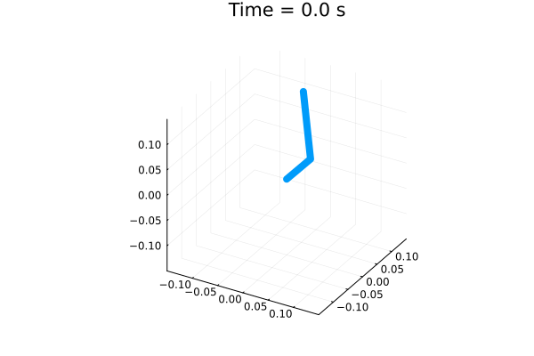
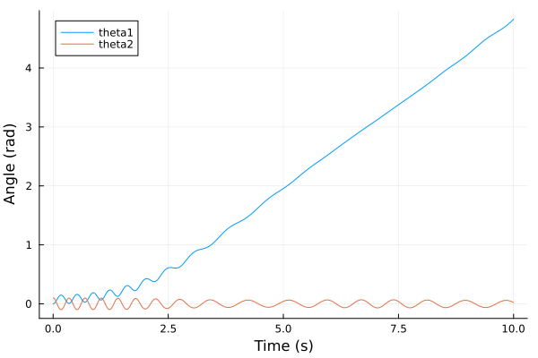

# Rotary Pendulum Simulation

- Script that derives the nonlinear state-space equations of motion of the EduKit inverted rotary pendulum,
intended to be used in the UKAEA PACE training programme. This follows the method shown in [the pdf](https://github.com/sherschm/RotaryInvertedPendulum/blob/main/Modelling%20%26%20Simulation%20of%20a%20rotary%20inverted%20pendulum.pdf)

- Simulates and animates the equations of motion:





For the details on the derivation, take a look at the pdf

## Preliminaries
[Install Julia](https://docs.julialang.org/en/v1/manual/installation/)

In Julia, import the required packages by running:
```bash
using Pkg
Pkg.add("Symbolics")
Pkg.add("LinearAlgebra")
Pkg.add("Plots")
Pkg.add("DifferentialEquations")
Pkg.add("Interpolations")
```

## Installation:

From a command prompt, navigate to your chosen install folder, then clone the repoo:

```bash
git clone git@git.ccfe.ac.uk:sherschm/rotaryinvertedpendulum.git
```
```bash
cd rotaryinvertedpendulum
```
## To run the modelling & simulation script from cmd prompt:
```bash
julia main.jl
```


