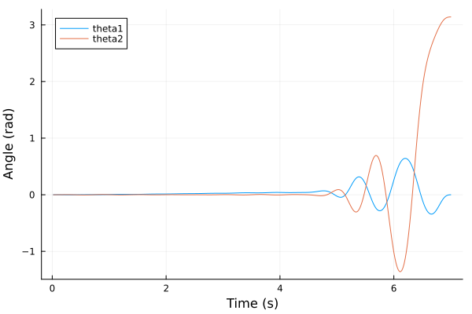

# Rotary Pendulum Simulation

- This repository contains a Julia script that derives the nonlinear state-space equations of motion of the EduKit inverted rotary pendulum, intended to be used in the UKAEA PACE training programme. 

 

The derivation of the dynamic model is detailed in [the pdf.](https://github.com/sherschm/RotaryInvertedPendulum/blob/main/Modelling%20%26%20Simulation%20of%20a%20rotary%20inverted%20pendulum.pdf)

## Preliminaries
- Install VSCode

- [Install Julia](https://docs.julialang.org/en/v1/manual/installation/)

- Install the Julia extension in VSCode

- From cmd prompt, clone this repository and navigate into to this folder:
 ```bash
git clone https://github.com/sherschm/RotaryInvertedPendulum.git
cd RotaryInvertedPendulum
code .
```

- run src/main.jl from VSCode. The first time may take a while due to importing / precompiling several required Julia packages.

- THis script runs through the model derivation and simulates LQR stabilisation control from some set of initial conditions: $[ \theta_1 \\ \theta_2 \\ \dot{\theta}_1 \\ \dot{\theta}_2]$ :

 

Then, it generates a 'swing-up' trajectory to get the pendulum from $\theta_2=0$ to $\theta_2=\pi$, using Interior point optimisation:

 
