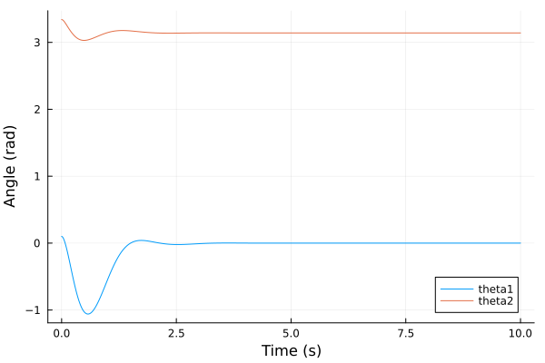
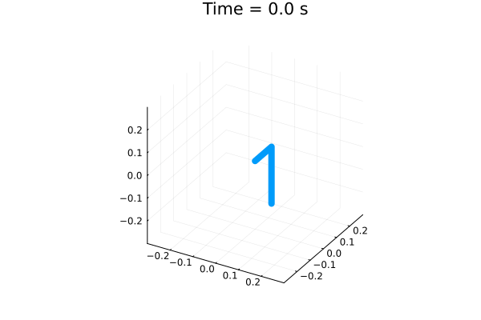

# Rotary Pendulum Simulation

- This repository contains a Julia script that derives the nonlinear state-space equations of motion of the EduKit inverted rotary pendulum, intended to be used in the UKAEA PACE training programme. 

 

The derivation of the dynamic model is detailed in [the pdf.](https://github.com/sherschm/RotaryInvertedPendulum/blob/main/Modelling%20%26%20Simulation%20of%20a%20rotary%20inverted%20pendulum.pdf)


## Preliminaries
[Install Julia](https://docs.julialang.org/en/v1/manual/installation/)

From a command prompt, run Julia

```bash
julia
```
In the Julia REPL, import the required packages by running:
```bash
using Pkg
Pkg.add("Symbolics")
Pkg.add("LinearAlgebra")
Pkg.add("Plots")
Pkg.add("DifferentialEquations")
Pkg.add("Interpolations")
Pkg.add("JuMP")
Pkg.add("Ipopt")
exit()
```

## To run the code from cmd prompt:
Clone the repository and move to its directory.

Run the script:

```bash
julia main.jl
```

This commented script runs through the model derivation and simulates LQR stabilisation control from some set of initial conditions: $[ \theta_1(t_0) \\ \theta_2(t_0) \\ \dot{\theta}_1(t_0) \\ \dot{\theta}_2(t_0)]$ :

 

Then, it generates a 'swing-up' trajectory to get the pendulum from $\theta_2=0$ to $\theta_2=\pi$, using Interior point optimisation:

 

## Next steps...
- Measure actual pendulum & correct parameters.
- Consider implementing a discrete time LQR if the control timestep is large.
- Implement robust control?
